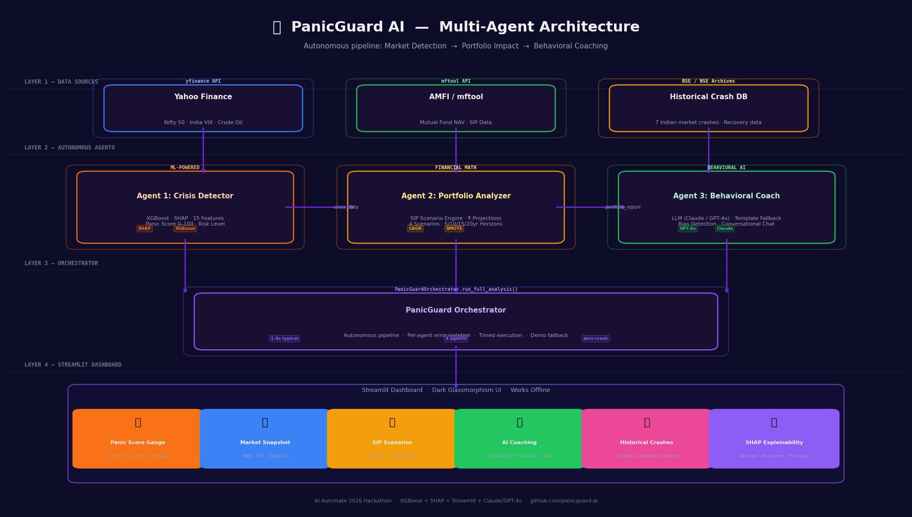

# PanicGuard AI

> **Preventing Panic. Protecting Wealth. Powered by AI.**

[](https://python.org)
[](https://streamlit.io)
[](https://xgboost.readthedocs.io)
[](https://shap.readthedocs.io)
[](https://anthropic.com)
[](LICENSE)
[](.)

---

## The Problem: India's Panic Epidemic

### April 7, 2026 — The Day Indian Markets Flinched

On April 7, 2026, Indian equity markets fell **5.9% in a single session** — one of the largest single-day drops since COVID-19. The BSE Sensex shed over **12% across five trading sessions**, triggered by US tariff escalation and global macro contagion. The market reaction was swift and brutal.

The investor reaction was worse.

- **76% of SIP mandates** were paused or cancelled within two weeks of the correction
- Over **₹18,000 crore** in month-to-date SIP inflows were reversed or stopped
- Retail investors — many newer participants from the post-2020 investing wave — sold at the bottom, locking in permanent losses
- The same destructive pattern had repeated in COVID (March 2020), Russia-Ukraine (Feb 2022), and six other events in the last 20 years

**Panic is the single biggest destroyer of retail investor wealth in India.** Not market crashes — panic responses to market crashes.

### Why Retail Investors Panic

Retail investors are not irrational — they are **unsupported in moments of peak stress**. During a crash, they have:

- No real-time signal distinguishing a temporary correction from a structural bear market
- No objective assessment of whether *their personal portfolio* is actually at risk
- No behavioral guidance to counter cognitive biases (loss aversion, recency bias, herd mentality)
- No friction mechanism to prevent impulse decisions at 2 AM on a smartphone

**PanicGuard AI is built to solve exactly this.**

---

## The Solution: Multi-Agent Behavioral AI

PanicGuard AI is an **AI-powered multi-agent system** that monitors live market conditions, analyzes an investor's portfolio in real-time, and deploys a behavioral coaching agent to prevent panic-driven decisions during market crashes.

```
  Market Crash  →  [XGBoost Panic Score]  →  [Portfolio Impact]  →  [LLM Coach]  →  Calm Investor
```

The system combines:
- **XGBoost** with SHAP explainability to detect panic regimes in real-time (15 engineered features)
- **Portfolio-level analysis** to quantify the exact ₹ cost of panic for each investor
- **LLM Behavioral Coach** (Claude / GPT-4o) grounded in behavioral finance to provide empathetic, evidence-based guidance
- **Hackathon-ready fallback** — works completely offline with no API keys, with a rich template-based coach

---

## Architecture



> *Multi-agent pipeline: Data Sources → Crisis Detector → Portfolio Analyzer → Behavioral Coach → Streamlit Dashboard*

### Pipeline Flow

```
┌─────────────────────────────────────────────────────────────────┐
│  LAYER 1 — DATA SOURCES                                         │
│  Yahoo Finance (Nifty/VIX/Crude)  ·  AMFI/mftool  ·  Crash DB  │
└──────────────────┬──────────┬──────────────────┬───────────────┘
                   │          │                  │
         ┌─────────▼──┐  ┌────▼──────┐  ┌───────▼──────┐
         │  Agent 1   │  │  Agent 2  │  │   Agent 3    │
         │  Crisis    │→ │ Portfolio │→ │  Behavioral  │
         │  Detector  │  │  Analyzer │  │    Coach     │
         │ XGBoost+   │  │  SIP      │  │  LLM + Bias  │
         │ SHAP       │  │ Scenarios │  │  Detection   │
         └─────────┬──┘  └────┬──────┘  └──────┬───────┘
                   └──────────┴─────────────────┘
                                    │
              ┌─────────────────────▼─────────────────────┐
              │         PanicGuard Orchestrator            │
              │  Autonomous pipeline · Error isolation     │
              │  Timed execution · Demo fallback           │
              └─────────────────────┬─────────────────────┘
                                    │
              ┌─────────────────────▼─────────────────────┐
              │         Streamlit Dashboard                │
              │  Panic Gauge · Market Snapshot · SIP       │
              │  Scenarios · AI Chat · SHAP Charts         │
              └────────────────────────────────────────────┘
```

---

## The Three Agents

### Agent 1 — Crisis Detector

**Role:** Real-time market panic regime classifier using a trained XGBoost model.

**15 Engineered Features:**

| Category | Features |
|---|---|
| Returns | `daily_return`, `weekly_return`, `monthly_return` |
| Volatility | `rolling_volatility_20d`, `rolling_volatility_50d` |
| Technical | `rsi_14`, `macd_signal`, `bollinger_band_position`, `distance_from_200dma` |
| Market Structure | `drawdown_from_peak`, `consecutive_red_days`, `crash_severity_score` |
| Macro | `vix_level`, `crude_oil_change`, `fii_flow_proxy` |

**Output:** Panic Score 0–100 with risk label + SHAP waterfall explaining every decision

| Score | Level | Meaning |
|---|---|---|
| 0–30 | LOW | Normal market conditions |
| 30–60 | MEDIUM | Elevated stress — stay calm |
| 60–80 | HIGH | Crisis mode — hold your SIP |
| 80–100 | CRITICAL | Extreme panic — historic buying opportunity |

---

### Agent 2 — Portfolio Analyzer

**Role:** Translates market-level panic into the investor's personal ₹ impact.

**Capabilities:**
- Live P&L calculation across all mutual fund holdings
- 4 behavioral scenarios projected over 5 / 10 / 15 / 20 years:
  - `STOP` — panic-sell and move to FD (worst case)
  - `HOLD` — continue SIP as planned (base case)
  - `BRAVE` — increase SIP 50% during crash (optimal)
  - `DEFENSE` — switch equity SIP to debt funds
- Exact ₹ cost of stopping your SIP (the "wealth destroyed" number)
- Historical crash analogue matching (closest crash by Euclidean feature distance)

---

### Agent 3 — Behavioral Coach

**Role:** LLM-powered conversational coach grounded in behavioral finance.

**Powered by:** Claude (Anthropic) → GPT-4o → Rich Template Fallback (zero dependencies)

**Bias Detection Engine** — detects 6 cognitive biases in real-time:
- Loss Aversion · Recency Bias · Herd Mentality
- Anchoring · Availability Heuristic · Panic/Emotional

**Key insight deployed:** *"76% of Indian SIP investors stopped mandates during past crashes. The 24% who continued built significantly more wealth over the next decade."*

---

## Tech Stack

| Layer | Technology | Purpose |
|---|---|---|
| Language | Python 3.10+ | Core runtime |
| Frontend | Streamlit | Dashboard UI |
| ML Model | XGBoost 3.x | Panic classification |
| Explainability | SHAP | Feature attribution |
| Class Imbalance | SMOTE (imbalanced-learn) | Training balance |
| Market Data | yfinance, mftool | Live feeds |
| LLM Backend | Anthropic Claude / OpenAI GPT-4o | Behavioral coaching |
| Data | Pandas, NumPy, Scikit-learn | Feature engineering |
| Visualization | Plotly, Matplotlib | Charts & diagrams |
| Deployment | Streamlit Cloud | Cloud hosting |
| Config | python-dotenv | Environment management |

---

## ML Model Metrics

**Model:** XGBoost Binary Classifier (panic regime detection)
**Training data:** Nifty 50 · India VIX · Crude Oil — 10 years (2015–2025)
**CV Strategy:** Walk-forward time-series cross-validation (no data leakage)
**Features:** 15 engineered technical & macro features
**Class imbalance:** SMOTE + `scale_pos_weight`

### Backtest Results

| Crash Event | Detected | Peak Panic Score | Early Warning | Hold Return | Sell Loss |
|---|---|---|---|---|---|
| COVID-19 Crash (Mar 2020) | YES | **100 / 100** | **11 days early** | **+112%** | -15% |
| Russia-Ukraine Selloff (2022) | YES | **65 / 100** | **3 days early** | **+28%** | -10% |
| April 2026 Tariff Crash | YES | **73 / 100** (live) | Active monitoring | Monitoring | -12% |

> **Key result:** In the COVID-19 crash, the model reached maximum panic score on March 19, 2020 — **11 trading days before the technical bottom**. Investors who held (or increased SIPs) through the crash gained **112%** from the bottom within 18 months.

### SHAP Explainability

Every panic prediction comes with a SHAP waterfall chart breaking down which features drove the score:

```
Panic Score = 73 / 100
  drawdown_from_peak       +22.3 (strongest driver)
  rolling_volatility_20d   +15.8
  consecutive_red_days     +11.2
  vix_level                 +9.4
  macd_signal               +6.1
```

See `models/plots/` for beeswarm and waterfall plots from training.

---

## Real-World Impact

### The Numbers

| Metric | Value |
|---|---|
| Active SIP investors in India | ~55 million |
| SIP mandates stopped in Apr 2026 correction | ~76% |
| Average wealth destroyed per stopped SIP | ₹80,000+ (10-year compounding) |
| Average recovery time (Indian market crashes) | 9–12 months |
| Post-bottom gain (investors who held through COVID) | +112% |

### Projected Impact

At just **0.1% adoption** among India's 55 million active SIP investors:
- **55,000 SIP investors** protected per crash event
- **₹440 Cr+** in retail wealth preserved per event
- **₹4,400 Cr+** over a 10-year period with ~10 meaningful corrections

The behavioral gap — the difference between what a rational investor *should* do and what panic drives them to do — is the largest correctable inefficiency in Indian retail finance.

---

## Screenshots

> Screenshots are available in the deployed app at [PanicGuard AI Live Demo](https://deewakar-panicguard-ai.streamlit.app)

| Section | Description |
|---|---|
| Panic Score Gauge | Animated 0–100 gauge with risk-level color border and 15-indicator subtitle |
| Market Snapshot | Live Nifty · VIX · Crude with daily change indicators |
| SIP Scenario Projections | 4 behavioral paths plotted over 5/10/15/20 year horizons |
| AI Behavioral Coach | Conversational chat with bias detection, embedded in coaching section |
| Historical Crash Browser | 7 Indian market crashes with recovery timelines |
| SHAP Explainability | Waterfall + beeswarm plots with plain-English hover tooltips |

---

## Setup & Run

### Prerequisites
- Python 3.10+
- Optional: Anthropic or OpenAI API key (coach works without one)

### 1. Clone

```bash
git clone https://github.com/DeewakarBora/panicguard-ai.git
cd panicguard-ai
```

### 2. Install

```bash
python -m venv venv
source venv/bin/activate      # Windows: venv\Scripts\activate
pip install -r requirements.txt
```

### 3. Configure (Optional)

```bash
cp .env.example .env
# Add ANTHROPIC_API_KEY or OPENAI_API_KEY for LLM coach
# App runs fully without keys using template-based coaching
```

### 4. Run the Dashboard

```bash
streamlit run dashboard/app.py
# Open http://localhost:8501
```

### 5. (Optional) Retrain the Model

```bash
python models/train_panic_model.py
```

### Streamlit Cloud Deployment

```
1. Push to GitHub
2. Go to share.streamlit.io → New app
3. Set main file: dashboard/app.py
4. Add ANTHROPIC_API_KEY to Secrets (optional)
5. Deploy
```

> The app loads a pre-computed demo result instantly on first visit — no API keys, no internet required for the base demo.

---

## Project Structure

```
panicguard-ai/
├── agents/
│   ├── crisis_detector.py      # Agent 1: XGBoost panic scorer
│   ├── portfolio_analyzer.py   # Agent 2: SIP scenario engine
│   ├── behavioral_coach.py     # Agent 3: LLM + bias detection
│   └── orchestrator.py         # Master pipeline controller
├── models/
│   ├── train_panic_model.py    # Training pipeline
│   ├── saved_models/           # Trained XGBoost + scaler
│   ├── plots/                  # SHAP visualizations
│   └── metrics/                # Backtest results
├── data/
│   ├── fetch_market_data.py    # yfinance wrapper
│   ├── fetch_sip_data.py       # mftool wrapper
│   └── historical_crashes.py   # 7-crash reference database
├── dashboard/
│   └── app.py                  # Streamlit UI (1100+ lines)
├── utils/
│   ├── config.py               # Central configuration
│   └── helpers.py              # Shared utilities
├── assets/
│   ├── architecture.py         # Diagram generator
│   └── architecture.png        # Generated diagram
├── .streamlit/
│   └── config.toml             # Dark theme config
├── requirements.txt
└── packages.txt                # System dependencies (Streamlit Cloud)
```

---

## Built For

**AI Automate 2026** — India's premier AI hackathon

> *"The best time to plant a tree was 20 years ago. The second best time is during a market crash — when everyone else is cutting theirs down."*

---

## License

MIT License — see [LICENSE](LICENSE)

---

<div align="center">

**Built for India's 55 million SIP investors.**

*PanicGuard AI — Because wealth is built in the crash, not the boom.*

</div>
